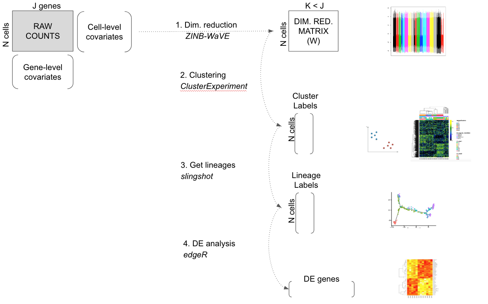

```{r options, echo=FALSE, results="hide",message=FALSE, error=FALSE, include=FALSE, autodep=TRUE}
knitr::opts_chunk$set(fig.align="center", cache=TRUE, error=FALSE, message=FALSE, warning=TRUE)
#bioconductor:
library(scRNAseq)
library(scone)
library(clusterExperiment)
#github
library(zinbwave)
library(slingshot)
#CRAN
library(ggplot2)
library(gplots)
library(magrittr)
library(matrixStats)
library(Rtsne)
library(RColorBrewer)
library(digest)
library(rARPACK)
set.seed(20)
if(packageVersion("clusterExperiment")<'1.3.0.9009') stop("must have current develop version to avoid bugs")
```

```{r}
runZinb <- T
runClus <- T
NCORES <- 7
```

EAP: small request. Can everyone put a line between the beginning of a r chunk and text? It makes it nicely formated for my text editor. 

EAP: if we are going to ultimately use these functions, it would be good to add them to the package for zinbwave.

FP: yes, I agree. Davide, we wait for zinbwave to be on bioconductor before to push changes, right?

```{r residuals}
compute.zinb.loglik <- function(Y, zinb){
  mu = t(getMu(zinb)) 
  theta = getTheta(zinb)
  theta_mat = matrix(rep(theta, ncol(Y), ncol = ncol(Y)))
  pi = t(getPi(zinb))
  log( pi * (Y == 0) + (1 - pi) * dnbinom(Y, size = theta, mu = mu) )
}

compute.deviance.residuals <- function(Y, zinb){
  mu_hat = t(getMu(zinb)) 
  pi_hat = t(getPi(zinb)) 
  Y_hat = (1 - pi_hat) * mu_hat
  ll = compute.zinb.loglik(Y, zinb)
  sign = 1*(Y - Y_hat > 0)
  sign[sign == 0] = -1
  sign * sqrt(-2 * ll)
}
```

# Steps of the workflow

We propose a worklow to analyze single cell RNA-Seq with the following steps

- Dimensionality reduction using zinbwave to get W which should capture the biology,
- Cluster cells using clusterExperiment on W to get the cluster labels,   
- Get lineage using slingshot on W and cluster labels from clusterExperiment,  
- Get DE genes between lineages/clusters.  

Along the worflow, use deviance residuals as adjusted values.

```{r frog-picture, out.width='90%', fig.align='center', fig.cap = 'Worflow to analyze single cell RNASeq data'}

```


## 1. Create a SummarizedExperiment object

Along the workflow, we want to use a unique SummarizedExperiement object carrying all the data we need.

EAP: I have updated the code to pull from a dataset on the repos that is created with the `createData.R` file. For now, I am filtering to the top 1000 most variable genes there, though we might want to add that to the code for the article. This will be slightly different data from Russell's, which didn't use all of the samples. We can adjust that decision later, or just compare the samples that are the same. (Russell's clusterLabels are in the meta data)

EAP: zinbFit doesn't accept data.frame objects, so currently have to have a `data.matrix` command. Should it be changed so that it does?

```{r datain}
#counts<-read.table("../data/oeCufflinkCountData.txt",sep="\t",header=TRUE)
core <- read.table("../data/oeCufflinkCountData_1000Var.txt",
                   sep = "\t", header = TRUE)
core <- data.matrix(core)
metadata <- read.table("../data/oeMetadata.txt", sep = "\t", header = TRUE)
# symbol for samples missing from original clustering
metadata$clusterLabels[is.na(metadata$clusterLabels)] <- -2
```

Here we only look at the 1000 most variable genes. EAP: see note above, I've commented out the filtering and added it to the `createData.R` for now. 

```{r batches}
batch <- metadata$Batch
```

Cells have been processed in `r length(unique(batch))` different batches

```{r}
col_batch = rep(brewer.pal(9, "Set1"), 2)
names(col_batch) = unique(batch)
table(batch)
```

We have qc measures from the data

```{r qc}
qc <- metadata[, !names(metadata) %in% c("Batch", "Experiment", "clusterLabels")]
head(qc, 2)
```

```{r clusterlabels}
clus.labels <- metadata[, "clusterLabels"]
```

In original work (FP: add ref), cells have been clustered into `r length(unique(clus.labels))` different clusters

```{r}
col_clus <- c("transparent", brewer.pal(12, "Set3"), brewer.pal(8, "Set2"))
col_clus <- col_clus[1:length(unique(clus.labels))]
names(col_clus) <- sort(unique(clus.labels))
table(clus.labels)
```

Batches are kind of confounded with the biology

```{r}
table(data.frame(batch = as.vector(batch),
                 cluster = clus.labels))
```

We have `r ncol(core)` cells.

```{r lookatdata}
dim(core)
core[1:3, 1:3]
```

Let's create a SummarizedExperiment object to store the raw counts and information about the data, that is batches, original labels, and quality control measures.

```{r}
se <- SummarizedExperiment(assays = list(rawCounts = core),
                           colData = metadata)
```


## 2. Dimensionality reduction adjusting for gene and cell-level covariates

To cluster and get lineages we want to reduce the dimension of the data. We are going to use zinbwave to do so. First, let's fit zinbwave with first K = 0 to compute normalized values (i.e. deviance residuals) adjusted for batches. We could also adjust for gene length or GC content here. We then fit zinbwave to get the dimensionality reduced matrix W specifying the number of dimension K = 50. Eventually, we will call zinbwave just once where we would have an argument in zinbFit like "compute_normalized_values" in c(TRUE, FALSE). For K = 0 and K = 50, we correct for batch effect including batches in X.

```{r}
fn0 <- '../data/zinb_k0_batch.rda'
if (runZinb & !file.exists(fn0)){
  mod <- model.matrix( ~ batch)
  print(system.time(zinb0 <- zinbFit(core, ncores = NCORES,
                                     K = 0, X = mod)))
  save(zinb0, file = fn0)
}else{
  load(fn0)
}

fn50 <- '../data/zinb_k50_batch.rda'
if (runZinb & !file.exists(fn50)){
  mod <- model.matrix( ~ batch)
  print(system.time(zinb50 <- zinbFit(core, ncores = NCORES,
                                      K = 50, X = mod)))
  save(zinb50, file = fn50)
}else{
  load(fn50)
}
```

### Normalized values

We use deviance residuals as normalized values for visualization. FP: explain rational: K=0 so residuals capture the bio adjusting for batch. Let's check that deviance residuals look ok.

```{r}
res <- compute.deviance.residuals(core, zinb0)
res[1:3,1:3]
```

Boxplot of the normalized values for each cell. It seems that correction for batches is ok.

```{r}
res_order <- res[, order(as.numeric(batch))]
col_order <- as.numeric(batch)[order(as.numeric(batch))]
boxplot(res_order, main='Boxplot of normalized values\ncolor=batch',
        col = col_order, staplewex = 0, outline = 0, border = col_order, xaxt = 'n')
```

PCA on the normalized values where color are for batches on the left and previously found clusters on the right. We want no clustering on the left side and clustering on the right side.

```{r}
pca <- prcomp(t(res))
par(mfrow = c(1,2))
plot(pca$x, col = col_batch[batch], pch = 20,
     main="PCA of normalized values\ncolor=batch")
plot(pca$x, col = col_clus[as.character(clus.labels)], pch = 20,
     main = "PCA of normalized values\ncolor=cluster")
par(mfrow = c(1,1))
```

Let's add the normalized values as an assay dataset in our SummarizedExperiment object.

```{r}
assays(se)[['normalizedValues']] <- res
```

### Dimensionality reduction

Let's check that performing MDS on W we have something coherent with original clusters.

```{r}
W <- getW(zinb50)
d <- dist(W)
fit <- cmdscale(d, eig = TRUE, k = 2)
plot(fit$points, col = col_clus[as.character(clus.labels)], main = 'MDS', pch = 20,
     xlab = 'Component 1', ylab = 'Component 2')
legend(x = 'bottomright', legend = unique(names(col_clus)), cex = .5,
       fill = unique(col_clus), title = 'Sample')
```

Let's add W to the colData of our SummarizedExperiment object.

```{r}
W <- data.frame(W)
colnames(W) <- paste0('W', 1:ncol(W))
colData(se) <- cbind(colData(se), W)
```


FP: what do you think of implemented a "compute_normalized_values" argument to zinbFit for summarizedExperiment objects where zinbFit would take as input a SummarizedExperiment object and return a summarizedExperiment object with slots added for normalized values and W?

## 2. Clustering of the cells

We use clusterExperiment with W.

FP: What about the following call to RSEC?

EP: I updated it to work on a SE object so that it has the meta data. If you have a summarized experiment object with W already, you could use that as long as assay(seObj) gives W. 


```{r rsec_50}
W <- colData(se)[, grepl('^W', colnames(colData(se)))]
W <- as.matrix(W)
fn <- '../data/RSEC_W.rda'
if (runClus & !file.exists(fn)){
  #symbol for samples missing from original clustering
	metadata$clusterLabels[is.na(metadata$clusterLabels)]<- -2 
  seObj<-SummarizedExperiment(t(W),colData=metadata)
  print(system.time(ceObj <- RSEC(seObj, k0s = 4:15, alphas = c(0.1),
                                  betas = 0.8,
                clusterFunction = "hierarchical01", minSizes=1,
                ncores = NCORES, isCount=FALSE,
                subsampleArgs = list(resamp.num=100,
                                     clusterFunction="kmeans",
                                     clusterArgs=list(nstart=10)),
                seqArgs = list(k.min=3, top.can=5), verbose=TRUE,
                combineProportion = 0.7,
                mergeMethod = "none")))
  save(ceObj, file = fn)
}else{
  load(fn)
}
```


```{r examineCombineMany}
plotClusters(ceObj, colPalette = c(bigPalette, rainbow(199)))
```

```{r plotcoclust}
plotCoClustering(ceObj)
```

```{r}
table(primaryClusterNamed(ceObj))
sum(primaryCluster(ceObj) == -1)
```

FP: Elizabeth, we are working with the W here, does the locfdr make sense in this context? I set eval=FALSE in the next chunk to skip the merging step, let me know if you would rather keep using it. And if we want to still use the merging step, would we want to include it in RSEC function arguments instead of separately?

EP: I don't think the merging step on the W makes a whole lot of sense -- the method is irrelevant. The merging is based on calculating the % of genes found significant (the specific method is arbitrary). The best thing would be to replace the W with residuals in the assay of `ceObj` (or whatever data that you will do the DE on for the time stuff below), and then run the merging step on that data.  I'm not particularly fond of `locfdr`. It was probably the method that gave the best merging to Russell and Diya. You'd really have to run `mergeClusters` setting `plotInfo="all"` and look at the results and decide both the cutoff level and the method. 

EP: Also, if you don't save the output of `mergeClusters` it doesn't update `ceObj`. I was calling it for just the resulting plots, since it was already merged in RSEC above. I've changed to code to update ceObj below. 

FP: Ha ok, good to know. I'll keep the eval=FALSE for the moment.

```{r examineMergeClusters,eval=FALSE}
#re-does merging simpling to make plot 
#something like:
#assay(ceObj)
# if that replacement data should be considered on the transformed scale in plots, etc, the transformation function should be fixed as well:
#transformation(ceObj)
ceObj<-mergeClusters(ceObj, mergeMethod = "locfdr",
              plotInfo = "mergeMethod", cutoff = 0.01)
```

FP: Not sure we should show the following heatmap using the W, we should rather use the normalized values (following heatmap). 

EP: Agreed

```{r heatmap, eval=FALSE}
plotHeatmap(ceObj, clusterSamplesData = "dendrogramValue", 
            breaks = .99)
```


So, let's look at a heatmap on normalized values.

FP: Elizabeth, I did not find how to define the column annotation track in the plot below to have the same colors as in ceObj@clusterLegend[[1]]. I tried to use arguments annColors and annCol from aheatmap as it is said in plotHeatmap documentation that for signature matrix arguments can be passed to aheatmap. But I got the error "The following arguments to aheatmap cannot be set by the user in plotHeatmap:Rowv,Colv,color,annCol,annColors".

EP: Fanny, you would need to use the argument 'clusterLegend'. That argument takes either the format of aheatmap (list with each element a *named* vector of colors) or the format of the clusterExperiment object (i.e. list with each element a matrix with columns for `name` and `color`). So I think the following code will run, though it might need the list to have names...

But an easier fix to the code would be to set `visualizeData` option. I haven't tested this because I don't have the objects need run, so let me know if there is error.

FP: it seems great to me, what do you think?

EP: We should be careful, because the default in plotHeatmap is to plot the 500 most variable genes (maybe a slightly paternalistic default). I've changed it to `all` in the code here. I've also added the plotting of the batch, experiment, and Russell's original clusters. We may not want to keep all of them, but probably at least Russell's clusters for comparison.

```{r}
# sampleData <- data.frame(ours = primaryCluster(ceObj))
# plotHeatmap(assays(se)$normalizedValues,
#             main = 'Normalized values, 1000 most variable genes',
#             clusterSamplesData = ceObj@dendro_samples,
#             sampleData = as.matrix(sampleData),clusterLegend=ceObj@clusterLegend[1])
# easier fix:
origClusterColors<-bigPalette[1:nlevels(colData(ceObj)$clusterLabels)]
experimentColors<-bigPalette[1:nlevels(colData(ceObj)$Experiment)]
batchColors<-bigPalette[1:nlevels(colData(ceObj)$Batch)]
metaColors<-list("Experiment"=experimentColors,"Batch"=batchColors,"clusterLabels"=origClusterColors)

plotHeatmap(ceObj, visualizeData = assays(se)$normalizedValues,
            whichClusters = "primary",clusterFeaturesData="all",
            clusterSamplesData = "dendrogramValue",
			sampleData=c("clusterLabels","Batch","Experiment"), clusterLegend=metaColors, annLegend=FALSE,
            main = 'Normalized values, 1000 most variable genes',
            breaks = 0.99)

```

```{r compareClusters}
plot(fit$points, col = col_clus[as.character(clus.labels)],
     main = 'MDS W, color = original clusters', pch = 20,
     xlab = 'Component1', ylab = 'Component2')
legend(x = 'bottomright', legend = unique(names(col_clus)), cex = .5,
       fill = unique(col_clus), title = 'Sample')
```

```{r}
palDF <- ceObj@clusterLegend[[1]]
pal <- palDF[, 'color']
names(pal) <- palDF[, 'name']
pal["-1"] = "transparent"
plot(fit$points, col = pal[primaryClusterNamed(ceObj)],
     main = 'MDS W, color = our new clusters', pch = 20,
     xlab = 'Component1', ylab = 'Component2')
legend(x = 'bottomright', legend = names(pal), cex = .5,
       fill = pal, title = 'Sample')
```


## 4. Pseudotime ordering

The goal of this section is to see if we need to refit zinbwave when we want to run slingshot. We first run slingshot on the W used by clusterExperiment. In the second part of this section, we fit zinbwave on the matrix of counts where the unassigned cells have been removed. For each part (without or with refitting zinbwave), we run slingshot in the supervised and unsupervised mode and try k=3, k=4, k=5 dimensions in W.

From what I understand, start original clusters are 1 and 5 (HBC) and end original clusters are 15 (Microvillus), 9 and 12 (neuron), and 4, 7 (Sus). Additionally, we want the GBC cluster to be a junction before the differentiation between Microvillus and Neuron. The correspondance with the original clusters is as follow

```{r}
table(data.frame(original = clus.labels, ours = primaryClusterNamed(ceObj)))
```

Cluster name | Description | Correspondence | Color
-------------|-------------|-----------------|---------
c1 | HBC | original 1, 5 | darkblue
c2 | new and small | new and small | green
c3 | new and small | new and small | red
c4 | GBC / immature neurons / MV 1 | original 2, 3, 11, 14 | orange
c5 | Sus | original 4, 7 | darkpurple
c6 | Neuron | original 9, 12 | brown
c7 | Immature Neuron | original 10, 14 | cian 
c8 | Immature Neuron | original 14 | lightpurple
c9 | Microvillus | original 15 | grayblue


FP: We need to work on the cluster coloring (!) and the matching with the clusters you found for the paper with Russell, maybe by changing the parameters in clusterMany?

EP: The function plotClusters aligns the clusters and can return the aligned coloring between clusterings. There is an option to return an updated CE object that changes the colors in clusterLegend to match the new colors found by aligning the clusters (`resetNames` and `resetColors` arguments). These haven't been extensively tested in real life because I don't think we've used them much. But it would be good to demonstrate!

FP: With all the improvements made, I think we simply have the correct colors now.

```{r}
Kvec <- c(3, 4, 5)
```

### Use previous W

The input of slingshot is the W used for clusterExperiment where the number of dimensions is reduced to k where k in (3, 4, 5) here.

#### Unsupervised

K = 3 does not seem very good to me: Sus is not an end cluster, GBC is an end cluster.

K = 4 is better, slingshot finds the end clusters but there is a spurious end cluster.

K = 5 does not seem great to me: GBC is an end cluster and Sus and Microvillus are in the same lineage.


```{r slingshot_unsup}
our_cl <- primaryClusterNamed(ceObj)
cl = our_cl[our_cl != "-1"]
pal = pal[names(pal) != '-1']
```

```{r}
for (k in Kvec){
  X <- W[our_cl != "-1", 1:k]

  lineages <- get_lineages(X, clus.labels = cl, start.clus = "c1")
  curves <- get_curves(X, clus.labels = cl, lineages = lineages)
  plot_curves(X, cl, curves, col.clus = pal)
  plot_tree(X, cl, lineages, col.clus = pal)

  print(paste0("K=", k))
  print(lineages$lineage1)
  print(lineages$lineage2)
  print(lineages$lineage3)
  print(lineages$lineage4)
  print(lineages$lineage5)
}
```

#### Supervised

K = 3 finds GBC as an end cluster (that I did not specify in the end.clus!).

K = 4 Yeah! it seems that it is what we want even if we still have a spurius end cluster and GBC not really at the junction.
 
K = 5 Yeah! even if GBC not really at the junction.

```{r slingshot_sup}
for (k in Kvec){
  X <- W[our_cl != "-1", 1:k]

  lineages <- get_lineages(X, clus.labels = cl, start.clus = "c1",
                           end.clus = c("c5", "c6", "c9"))
  curves <- get_curves(X, clus.labels = cl, lineages = lineages)
  plot_curves(X, cl, curves, col.clus = pal)
  plot_tree(X, cl, lineages, col.clus = pal)

  print(paste0("K=", k))
  print(lineages$lineage1)
  print(lineages$lineage2)
  print(lineages$lineage3)
  print(lineages$lineage4)
  print(lineages$lineage5)
}
```


### Re-fitting zinbwave
#### Unsupervised

K = 3 is better than when we did not refit zinbwave but still not perfect: Sus in all the clusters. GBC not really at the junction.

K = 4 good even if GBC not really at the junction.

K = 5 not great GBC is an end cluster.

```{r refit_zinb}
mod <- model.matrix(~ batch[our_cl != "-1"])
fn <- '../data/refit_zinbwave_slingshot.rda'
if (runZinb & !file.exists(fn)){
  zinbList <- lapply(Kvec, function(k){
    zinbFit(core[, our_cl != "-1"], X = mod, K = k, ncores = NCORES)
  })
  save(zinbList, file = fn)
}else{
  load(fn)
}
```

```{r slingshot_unsup_refit}
for(k in Kvec) {
  X <- getW(zinbList[[k - 2]])[, 1:k]

  lineages <- get_lineages(X, clus.labels = cl, start.clus = "c1")
  curves <- get_curves(X, clus.labels = cl, lineages = lineages)
  plot_curves(X, cl, curves, col.clus = pal)
  plot_tree(X, cl, lineages, col.clus = pal)

  print(paste0("K=", k))
  print(lineages$lineage1)
  print(lineages$lineage2)
  print(lineages$lineage3)
  print(lineages$lineage4)
  print(lineages$lineage5)
}
```

#### Supervised

K = 3 Yeah! close to perfection.

K = 4 good even if GBC not really at the junction.

K = 5 no, GBC is an end cluster.

```{r slingshot_sup_refit}
for(k in Kvec){
  X <- getW(zinbList[[k - 2]])[, 1:k]

  lineages <- get_lineages(X, clus.labels = cl, start.clus = "c1",
                           end.clus = c("c5", "c6", "c9"))
  curves <- get_curves(X, clus.labels = cl, lineages = lineages)
  plot_curves(X, cl, curves, col.clus = pal)
  plot_tree(X, cl, lineages, col.clus = pal)

  print(paste0("K=", k))
  print(lineages$lineage1)
  print(lineages$lineage2)
  print(lineages$lineage3)
  print(lineages$lineage4)
  print(lineages$lineage5)
}
```

CONCLUSION: K = 5 is never great as GBC is generally an end cluster. K = 4 is ok for all the methods and a bit better when zinbwave is refitted. K = 3 when refitting and supervized is good.  

It seems to me that using slingshot on W without re-fitting zinbwave with k = 4 gives good results where supervized mode is slightly better than unsupervized. It is just a one shot example and we should obviously not make a general conclusion, but I think that for the purpose of the workflow it is fine to use slingshot without refitting zinbwave. We should write a note to the user that it is better to refit zinbwave to have more power.

## 5. DE analysis

Here is the kind of plots we want to present

```{r}
de <- read.csv('../data/oe_markers.txt', stringsAsFactors = F, header = F)
de <- de$V1
plotHeatmap(ceObj, 
            visualizeData = assays(se)$normalizedValues[rownames(se) %in% de, ],
            clusterSamplesData = "dendrogramValue",
            whichClusters = "primary",
            main = 'Normalized values, 1000 most variable genes',
            breaks = 0.99)
```

FP: Kelly, is it you who did the DE analysis for Russell paper? If yes, what tool did you use? On what data? The full quantile normalized counts? Do you have code available?

# Session Info

```{r}
sessionInfo()
```
