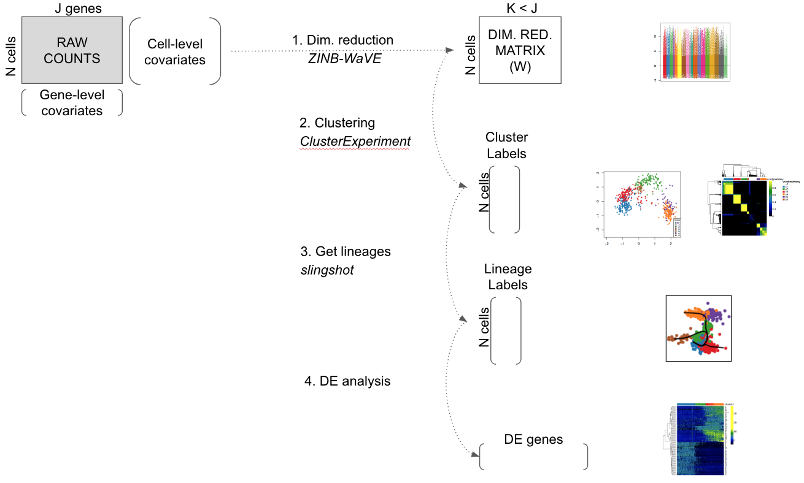

```{r options, echo=FALSE, results="hide",message=FALSE, error=FALSE, include=FALSE, autodep=TRUE}
if(packageVersion("zinbwave")<"0.99.6") stop("must have current devel version to avoid bugs")
if(packageVersion("clusterExperiment")<"1.3.2") stop("must have current devel version to avoid bugs")
if(packageVersion("scone")<"1.1.2") stop("must have current devel version to avoid bugs")

library(BiocStyle)
library(knitr)
knitr::opts_chunk$set(cache=TRUE, error=FALSE, message=FALSE, warning=FALSE)
knitr::opts_chunk$set(fig.align="center", fig.width=5, fig.height=5)
```

# Introduction

Single-cell RNA sequencing (scRNA-seq) is a powerful and promising class of high-throughput assays that enable researchers to measure genome-wide transcription levels at the resolution of single cells. To properly account for features specific to scRNA-seq, such as zero inflation and high levels of technical noise, several novel statistical methods have been developed to tackle questions that include normalization, dimensionality reduction, clustering, the inference of cell lineages and pseudotimes, and the identification of differentially expressed (DE) genes. While each individual method is useful on its own for addressing a specific question, there is an increasing need for workflows that integrate these tools to yield a seamless scRNA-seq data analysis pipeline. This is all the more true, with novel sequencing technologies that allow an increasing number of cells to be sequenced in each run. For example, the Chromium Single Cell 3' Solution was recently used to sequence and profile about 1.3 million cells from embryonic mouse brains. 

scRNA-seq low-level analysis workflows have already been developed, with useful methods for quality control (QC), exploratory data analysis (EDA), pre-processing, normalization, and visualization. The workflow described in [@Lun2016] and the package `scater` [@McCarthy2017] are such examples based on open-source R software packages from the Bioconductor Project [@Huber2015]. In these workflows, single-cell expression data are organized in objects of the `SCESet` class allowing integrated analysis. However, these workflows are mostly used to prepare the data for further downstream analysis and do not focus on steps such as cell clustering and lineage inference.

Here, we propose an integrated workflow for dowstream analysis, with the following four main steps: (1) dimensionality reduction accounting for zero inflation and over-dispersion and adjusting for gene and cell-level covariates, using the `zinbwave` Bioconductor package; (2) robust and stable cell clustering using resampling-based sequential ensemble clustering, as implemented in the `clusterExperiment` Bioconductor package; (3) inference of cell lineages and ordering of the cells by developmental progression along lineages, using the `slingshot` R package; and (4) DE analysis along lineages. Throughout the workflow, we use a single `SummarizedExperiment` object to store the scRNA-seq data along with any gene or cell-level metadata available from the experiment.

```{r schema, echo=FALSE, out.width="90%", fig.cap="Workflow for analyzing scRNA-seq datasets. On the right, main plots generated by the workflow."}

```

# Analysis of olfactory stem cell differentiation using scRNA-seq data

## Overview

```{r stemcelldiff, echo=FALSE, out.width="60%", fig.align="center", fig.cap = "Stem cell differentiation in the mouse olfactory epithelium. This figure was reproduced with kind permission from Fletcher et al. (2017)."}
knitr::include_graphics("stemcelldiff_Fletcher2017_2e.png")
```

This workflow is illustrated using data from a scRNA-seq study of stem cell differentiation in the mouse olfactory epithelium (OE) [@Fletcher2017]. The olfactory epithelium contains mature olfactory sensory neurons (mOSN) that are continuously renewed in the epithelium via neurogenesis through the differentiation of globose basal cells (GBC), which are the actively proliferating cells in the epithelium. When a severe injury to the entire tissue happens, the olfactory epithelium can regenerate from normally quiescent stem cells called horizontal basal cells (HBC), which become activated to differentiate and reconstitute all major cell types in the epithelium.

The scRNA-seq dataset we use as a case study was generated to study the differentitation of HBC stem cells into different cell types present in the olfactory epithelium. To map the developmental trajectories of the multiple cell lineages arising from HBCs, scRNA-seq was performed on FACS-purified cells using the Fluidigm C1 microfluidics cell capture platform followed by Illumina sequencing. The expression level of each gene in a given cell was quantified by counting the total number of reads mapping to it. Cells were then assigned to different lineages using a statistical analysis pipeline analogous to that in the present workflow. Finally, results were validated experimentally using in vivo lineage tracing. Details on data generation and statistical methods are available in [@Fletcher2017; @Risso2017; @Street2017].

It was found that the first major bifurcation in the HBC lineage trajectory occurs prior to cell division, producing either mature sustentacular (mSUS) cells or GBCs. Then, the GBC lineage, in turn, branches off to give rise to mOSN, microvillous (MV) cells, and cells of the Bowman gland (Figure \@ref(fig:stemcelldiff)). In this workflow, we describe a sequence of steps to recover the lineages found in the original study, starting from the genes x cells matrix of raw counts publicly-available at https://www.ncbi.nlm.nih.gov/geo/query/acc.cgi?acc=GSE95601.

## Package versions

The following packages are needed.

```{r packages}
# Bioconductor
library(BiocParallel)
library(clusterExperiment)
library(scone)
library(zinbwave)

# GitHub
library(slingshot)

# CRAN
library(doParallel)
library(gam)
library(RColorBrewer)

set.seed(20)
```

Note that in order to successfully run the workflow, we need the devel versions
of the Bioconductor packages `scone (>=1.1.2)`, `zinbwave (>=0.99.6)`, and `clusterExperiment (>=1.3.2)`. We recommend running Bioconductor 3.6 (currently the devel version; see https://www.bioconductor.org/developers/how-to/useDevel/).

## Parallel computating

To give an idea to the users of the time needed to run the workflow, function `system.time` was used to report computation times for the time consuming functions. Computations were performed with 2 cores on a MacBook Pro (early 2015) with a 2.7 GHz Intel Core i5 processor and 8 GB of RAM. The `BiocParallel` package is used to allow for parallel computing in `zinbwave` function. Users with a different operating system may change the package used for parallel computing and the `NCORES` variable below.

```{r parallel}
NCORES <- 2
mysystem = Sys.info()[["sysname"]]
if (mysystem == "Darwin"){
  registerDoParallel(NCORES)
  register(DoparParam())
}else if (mysystem == "Linux"){
  register(bpstart(MulticoreParam(workers=NCORES)))
}else{
  print("Please change this to allow parallel computing on your computer.")
  register(SerialParam())
}
```


## Pre-processing

Counts for all genes in each cell were obtained from NCBI Gene Expression Omnibus (GEO), with accession number GSE95601. Before filtering, the dataset has 849 cells and 28,361 detected genes (i.e., genes with non-zero read counts). 

Note that in the following, we assume that the user has access to a data folder located at `../data`. Users with a different directory structure may need to change the `data_dir` variable below to reproduce the workflow.

```{r datain}
data_dir <- "../data/"

urls = c("https://www.ncbi.nlm.nih.gov/geo/download/?acc=GSE95601&format=file&file=GSE95601%5FoeHBCdiff%5FCufflinks%5FeSet%2ERda%2Egz",
         "https://raw.githubusercontent.com/rufletch/p63-HBC-diff/master/ref/oeHBCdiff_clusterLabels.txt")
         
if(!file.exists(paste0(data_dir, "GSE95601_oeHBCdiff_Cufflinks_eSet.Rda"))) {
  download.file(urls[1], paste0(data_dir, "GSE95601_oeHBCdiff_Cufflinks_eSet.Rda.gz"))
  R.utils::gunzip(paste0(data_dir, "GSE95601_oeHBCdiff_Cufflinks_eSet.Rda.gz"))
}

if(!file.exists(paste0(data_dir, "oeHBCdiff_clusterLabels.txt"))) {
  download.file(urls[2], paste0(data_dir, "oeHBCdiff_clusterLabels.txt"))
}
```

```{r}
load(paste0(data_dir, "GSE95601_oeHBCdiff_Cufflinks_eSet.Rda"))

# Count matrix
E <- assayData(Cufflinks_eSet)$counts_table

# Remove undetected genes
E <- na.omit(E)
E <- E[rowSums(E)>0,]
dim(E)
```

We remove the ERCC spike-in sequences and the CreER gene, as the latter corresponds to the estrogen receptor fused to Cre recombinase (Cre-ER), which is used to activate HBCs into differentiation following injection of tamoxifen (see [@Fletcher2017] for details).

```{r}
# Remove ERCC and CreER genes
cre <- E["CreER",]
ercc <- E[grep("^ERCC-", rownames(E)),]
E <- E[grep("^ERCC-", rownames(E), invert = TRUE), ]
E <- E[-which(rownames(E)=="CreER"), ]
dim(E)
```

Throughout the workflow, we use the class `SummarizedExperiment` to keep track of the counts and their associated metadata within a single object. The cell-level metadata contain quality control measures, sequencing batch ID, and cluster and lineage labels from the original publication [@Fletcher2017]. Cells with a cluster label of `-2` were not assigned to any cluster in the original publication.

```{r}
# Extract QC metrics
qc <- as.matrix(protocolData(Cufflinks_eSet)@data)[,c(1:5, 10:18)]
qc <- cbind(qc, CreER = cre, ERCC_reads = colSums(ercc))

# Extract metadata
batch <- droplevels(pData(Cufflinks_eSet)$MD_c1_run_id)
bio <- droplevels(pData(Cufflinks_eSet)$MD_expt_condition)
clusterLabels <- read.table(paste0(data_dir, "oeHBCdiff_clusterLabels.txt"),
                            sep = "\t", stringsAsFactors = FALSE)
m <- match(colnames(E), clusterLabels[, 1])

# Create metadata data.frame
metadata <- data.frame("Experiment" = bio,
                       "Batch" = batch,
                       "publishedClusters" = clusterLabels[m,2],
                       qc)

# Symbol for cells not assigned to a lineage in original data
metadata$publishedClusters[is.na(metadata$publishedClusters)] <- -2

se <- SummarizedExperiment(assays = list(counts = E),
                           colData = metadata)
se
```

Using the Bioconductor R package `scone`, we remove low-quality cells according to the quality control filter implemented in the function `metric_sample_filter` and based on the following criteria (Figure \@ref(fig:scone)): (1) Filter out samples with low total number of reads or low alignment percentage and (2) filter out samples with a low detection rate for housekeeping genes. See the [scone vignette](https://www.bioconductor.org/packages/release/bioc/vignettes/scone/inst/doc/sconeTutorial.html) for details on the filtering procedure.

```{r scone, fig.cap="SCONE: Filtering of low-quality cells."}
# QC-metric-based sample-filtering
data("housekeeping")
hk = rownames(se)[toupper(rownames(se)) %in% housekeeping$V1]

mfilt <- metric_sample_filter(assay(se), 
                              nreads = colData(se)$NREADS,
                              ralign = colData(se)$RALIGN,
                              pos_controls = rownames(se) %in% hk,
                              zcut = 3, mixture = FALSE,
                              plot = TRUE)
```

```{r sconeFilt}
# Simplify to a single logical
mfilt <- !apply(simplify2array(mfilt[!is.na(mfilt)]), 1, any)
se <- se[, mfilt]
dim(se)
```

After sample filtering, we are left with `r ncol(se)` good quality cells.

Finally, for computational efficiency, we retain only the 1,000 most variable genes. This seems to be a reasonnable choice for the illustrative purpose of this workflow, as we are able to recover the biological signal found in the published analysis ([@Fletcher2017]). In general, however, we recommend care in selecting a gene filtering scheme, as an appropriate choice is dataset-dependent. 


```{r}
# Filtering to top 1,000 most variable genes
vars <- rowVars(log1p(assay(se)))
names(vars) <- rownames(se)
vars <- sort(vars, decreasing = TRUE)
core <- se[names(vars)[1:1000],]
```

## Dataset structure

Overall, after the above pre-processing steps, our dataset has 1,000 genes and 747 cells.

```{r}
core
```

Metadata for the cells are stored in the slot `colData` from the `SummarizedExperiment` object. Cells were processed in 18 different batches.

```{r batch}
batch <- colData(core)$Batch
col_batch = c(brewer.pal(9, "Set1"), brewer.pal(8, "Dark2"), 
              brewer.pal(8, "Accent")[1])
names(col_batch) = unique(batch)
table(batch)
```

In the original work [@Fletcher2017], cells were clustered into 14 different clusters, with 151 cells not assigned to any cluster (i.e., cluster label of `-2`). 

```{r original}
publishedClusters <- colData(core)[, "publishedClusters"]
col_clus <- c("transparent", "#1B9E77", "antiquewhite2", "cyan", "#E7298A", 
              "#A6CEE3", "#666666", "#E6AB02", "#FFED6F", "darkorchid2", 
              "#B3DE69", "#FF7F00", "#A6761D", "#1F78B4")
names(col_clus) <- sort(unique(publishedClusters))
table(publishedClusters)
```

Note that there is partial nesting of batches within clusters (i.e., cell type), which could be problematic when correcting for batch effects in the dimensionality reduction step below.

```{r clustbatch}
table(data.frame(batch = as.vector(batch),
                 cluster = publishedClusters))
```

## Normalization and dimensionality reduction: ZINB-WaVE

In scRNA-seq analysis, dimensionality reduction is often used as a preliminary step prior to downstream analyses, such as clustering, cell lineage and pseudotime ordering, and the identification of DE genes. This allows the data to become more tractable, both from a statistical (cf. curse of dimensionality) and computational point of view. Additionally, technical noise can be reduced while preserving the often intrinsically low-dimensional signal of interest [@Peer2017; @Pierson2015; @Risso2017].

Here, we perform dimensionality reduction using the zero-inflated negative binomial-based wanted variation extraction (ZINB-WaVE) method implemented in the Bioconductor R package `zinbwave`. The method fits a ZINB model that accounts for zero inflation (dropouts), over-dispersion, and the count nature of the data. The model can include a cell-level intercept, which serves as a global-scaling normalization factor. The user can also specify both gene-level and cell-level covariates. The inclusion of observed and unobserved cell-level covariates enables normalization for complex, non-linear effects (often referred to as batch effects), while gene-level covariates may be used to adjust for sequence composition effects (e.g., gene length and GC-content effects). A schematic view of the ZINB-WaVE model is provided in Figure \@ref(fig:zinbschema). For greater detail about the ZINB-WaVE model and estimation procedure, please refer to the original manuscript [@Risso2017].

```{r zinbschema, echo=FALSE, out.width="95%", fig.cap="ZINB-WaVE: Schematic view of the ZINB-WaVE model. This figure was reproduced with kind permission from Risso et al. (2017)."}
knitr::include_graphics("zinb_schema.png")
```

As with most dimensionality reduction methods, the user needs to specify the number of dimensions for the new low-dimensional space. Here, we use `K = 50` dimensions and adjust for batch effects via the matrix `X`. Note that if the users include more genes in the analysis, it may be preferable to reduce `K` to achieve a similar computational time.

```{r zinb}
print(system.time(se <- zinbwave(core, K = 50, X = "~ Batch",  
                                 residuals = TRUE,
                                 normalizedValues = TRUE)))
```

### Normalization

The function `zinbwave` returns a `SummarizedExperiment` object that includes normalized expression measures, defined as deviance residuals from the fit of the ZINB-WaVE model with user-specified gene- and cell-level covariates. Such residuals can be used for visualization purposes (e.g., in heatmaps, boxplots). Note that, in this case, the low-dimensional matrix `W` is not included in the computation of residuals to avoid the removal of the biological signal of interest.

```{r norm}
norm <- assays(se)$normalizedValues
norm[1:3,1:3]
```

As expected, the normalized values no longer exhibit batch effects (Figure \@ref(fig:boxplotNorm)).

```{r boxplotNorm, fig.cap="ZINB-WaVE: Boxplots of normalized expression measures (deviance residuals), color-coded by batch."}
norm_order <- norm[, order(as.numeric(batch))]
col_order <- col_batch[batch[order(as.numeric(batch))]]
boxplot(norm_order, col = col_order, staplewex = 0, outline = 0,
        border = col_order, xaxt = "n", ylab="Expression measure")
abline(h=0)
```

The principal component analysis (PCA) of the normalized values shows that, as expected, cells do not cluster by batch but by the original clusters (Figure \@ref(fig:pcanorm)). Overall, it seems that normalization was effective at removing batch effects without removing biological signal, in spite of the partial nesting of batches within clusters.

```{r pcanorm, fig.cap="ZINB-WaVE: PCA of normalized expression measures, where each point represents a cell. Cells are color-coded by batch (left panel) and by original published clustering (right panel)."}
pca <- prcomp(t(norm))
par(mfrow = c(1,2))
plot(pca$x, col = col_batch[batch], pch = 20, main = "")
plot(pca$x, col = col_clus[as.character(publishedClusters)], pch = 20, main = "")
```

### Dimensionality reduction

The `zinbwave` function can also be used to perform dimensionality reduction, where, in this workflow, the user-supplied dimension `K` of the low-dimensional space is set to `K = 50`. The resulting low-dimensional matrix `W` can be visualized in two dimensions by performing multi-dimensional scaling (MDS) using the Euclidian distance. To verify that `W` indeed captures the biological signal of interest, we display the MDS results in a scatterplot with colors corresponding to the original published clusters (Figure \@ref(fig:mdsW)).

```{r mdsW, fig.cap="ZINB-WaVE: MDS of the low-dimensional matrix W, where each point represents a cell and cells are color-coded by original published clustering."}
W <- colData(se)[, grepl("^W", colnames(colData(se)))]
W <- as.matrix(W)
d <- dist(W)
fit <- cmdscale(d, eig = TRUE, k = 2)
plot(fit$points, col = col_clus[as.character(publishedClusters)], main = "",
     pch = 20, xlab = "Component 1", ylab = "Component 2")
legend(x = "topleft", legend = unique(names(col_clus)), cex = .5,
       fill = unique(col_clus), title = "Sample")
```

## Cell clustering: RSEC

The next step of the workflow is to cluster the cells according to the low-dimensional matrix `W` computed in the previous step. We use the resampling-based sequential ensemble clustering (RSEC) framework implemented in the `RSEC` function from the Bioconductor R package `clusterExperiment`. Specifically, given a set of user-supplied base clustering algorithms and associated tuning parameters (e.g., _k_-means, with a range of values for _k_), RSEC generates a collection of candidate clusterings, with the option of resampling cells and using a sequential tight clustering procedure as in [@Tseng2005]. A consensus clustering is obtained based on the levels of co-clustering of samples across the candidate clusterings. The consensus clustering is further condensed by merging similar clusters, which is done by creating a hierarchy of clusters, working up the tree, and testing for differential expression between sister nodes, with nodes of insufficient DE collapsed. As in supervised learning, resampling greatly improves the stability of clusters and considering an ensemble of methods and tuning parameters allows us to capitalize on the different strengths of the base algorithms and avoid the subjective selection of tuning parameters. 

Note that the defaults in `RSEC` are designed for input data that are the actual (normalized) counts. Here, we are applying `RSEC` instead to the low-dimensional `W` matrix from ZINB-WaVE, for which we make a separate `SummarizedExperiment` object. For this reason, we choose to not use certain options in `RSEC`. In particular, we do not use the default dimensionality reduction step, since our input `W` is already in a space of reduced dimension. Specifically, `RSEC` offers a dimensionality reduction option for the input to both the clustering routines (`dimReduce`) and the construction of the hiearchy between the clusters (`dendroReduce`). We also skip the option to merge our clusters based on the amount of differential gene expression between clusters.
  
```{r rsec_50}
seObj <- SummarizedExperiment(t(W), colData = colData(core))
print(system.time(ceObj <- RSEC(seObj, k0s = 4:15, alphas = c(0.1),
                                betas = 0.8, dimReduce="none",
                                clusterFunction = "hierarchical01", minSizes=1,
                                ncores = NCORES, isCount=FALSE,
                                dendroReduce="none",dendroNDims=NA,
                                subsampleArgs = list(resamp.num=100,
                                                     clusterFunction="kmeans",
                                                     clusterArgs=list(nstart=10)),
                                verbose=TRUE,
                                combineProportion = 0.7,
                                mergeMethod = "none", random.seed=424242,
                                combineMinSize = 10)))
```

The resulting candidate clusterings can be visualized using the `plotClusters` function (Figure \@ref(fig:examineCombineMany)), where columns correspond to cells and rows to different clusterings. Each sample is color-coded based on its clustering for that row, where the colors have been chosen to try to match up clusters that show large overlap accross rows. The first row correspond to a consensus clustering across all candidate clusterings.

```{r examineCombineMany, fig.cap="RSEC: Candidate clusterings found using the function RSEC from the clusterExperiment package."}
plotClusters(ceObj, colPalette = c(bigPalette, rainbow(199)))
```

The `plotCoClustering` function produces a heatmap of the co-clustering matrix, which records, for each pair of cells, the proportion of times they were clustered together across the candidate clusters (Figure \@ref(fig:plotcoclust)). 

```{r plotcoclust, fig.cap="RSEC: Heatmap of co-clustering matrix."}
plotCoClustering(ceObj)
```

The distribution of cells across the consensus clusters can be visualized in Figure \@ref(fig:barplotOurs) and is as follows:

```{r tableclust}
table(primaryClusterNamed(ceObj))
```

```{r barplotOurs, fig.cap="RSEC: Barplot of number of cells per cluster for our workflow's RSEC clustering."}
plotBarplot(ceObj, legend = FALSE) 
```

The distribution of cells in our workflow's clustering overall agrees with that in the original published clustering (Figure \@ref(fig:addPublishedClusters)), the main difference being that several of the published clusters were merged here into single clusters. This discrepancy is likely caused by the fact that we started with the top 1,000 genes, which might not be enough to discriminate between closely related clusters.

```{r addPublishedClusters, fig.cap="RSEC: Barplot of number of cells per cluster, for our workflow's RSEC clustering, color-coded by original published clustering."}
ceObj <- addClusters(ceObj, colData(ceObj)$publishedClusters, 
                     clusterLabel = "publishedClusters")

## change default color to match with Figure 7
clusterLegend(ceObj)$publishedClusters[, "color"] <- 
  col_clus[clusterLegend(ceObj)$publishedClusters[, "name"]]

plotBarplot(ceObj, whichClusters=c("combineMany","publishedClusters"),
            xlab = "", legend = FALSE)
```
 
Figure \@ref(fig:heatmapsClusters) displays a heatmap of the normalized expression measures for the 1,000 most variable genes, where cells are clustered according to the RSEC consensus.

```{r heatmapsClusters, fig.cap="RSEC: Heatmap of the normalized expression measures for the 1,000 most variable genes, where rows correspond to genes and columns to cells ordered by RSEC clusters."}
# Set colors for cell clusterings
colData(ceObj)$publishedClusters <- as.factor(colData(ceObj)$publishedClusters)
origClusterColors <- bigPalette[1:nlevels(colData(ceObj)$publishedClusters)]
experimentColors <- bigPalette[1:nlevels(colData(ceObj)$Experiment)]
batchColors <- bigPalette[1:nlevels(colData(ceObj)$Batch)]
metaColors <- list("Experiment" = experimentColors,
                   "Batch" = batchColors,
                   "publishedClusters" = origClusterColors)

plotHeatmap(ceObj, visualizeData = assays(se)$normalizedValues,
            whichClusters = "primary", clusterFeaturesData = "all",
            clusterSamplesData = "dendrogramValue", breaks = 0.99,
            sampleData = c("publishedClusters", "Batch", "Experiment"),
            clusterLegend = metaColors, annLegend = FALSE, main = "")
```

Finally, we can visualize the cells in a two-dimensional space using the MDS of the low-dimensional matrix `W` and coloring the cells according to their newly-found RSEC clusters (Figure \@ref(fig:mdsWce)); this is anologous to Figure \@ref(fig:mdsW) for the original published clusters.

```{r mdsWce, fig.cap="RSEC: MDS of the low-dimensional matrix W, where each point represents a cell and cells are color-coded by RSEC clustering."}
palDF <- ceObj@clusterLegend[[1]]
pal <- palDF[, "color"]
names(pal) <- palDF[, "name"]
pal["-1"] = "transparent"
plot(fit$points, col = pal[primaryClusterNamed(ceObj)], main = "", pch = 20,
     xlab = "Component1", ylab = "Component2")
legend(x = "topleft", legend = names(pal), cex = .5,
       fill = pal, title = "Sample")
```

## Cell lineage and pseudotime inference: Slingshot

We now demonstrate how to use the R software package `slingshot` to infer branching cell lineages and order cells by developmental progression along each lineage. The method, proposed in [@Street2017], comprises two main steps: (1) The inference of the global lineage structure (i.e., the number of lineages and where they branch) using a minimum spanning tree (MST) on the clusters identified above by `RSEC` and (2) the inference of cell pseudotime variables along each lineage using a novel method of simultaneous principal curves. The approach in (1) allows the identification of any number of novel lineages, while also accommodating the use of domain-specific knowledge to supervise parts of the tree (e.g., known terminal states); the approach in (2) yields robust pseudotimes for smooth, branching lineages. 

The two steps of the Slingshot algorithm are implemented in the functions `getLineages` and `getCurves`, respectively. The first takes as input a low-dimensional representation of the cells and a vector of cluster labels. It fits an MST to the clusters and identifies lineages as paths through this tree. The output of `getLineages` is an object of class `SlingshotDataSet` containing all the information used to fit the tree and identify lineages. The function `getCurves` then takes this object as input and fits simultaneous principal curves to the identified lineages. These functions can be run separately, as below, or jointly by the wrapper function `slingshot`.

From the original published work, we know that the start cluster should correspond to HBCs and the end clusters to MV, mOSN, and mSUS cells. Additionally, we know that GBCs should be at a junction before the differentiation between MV and mOSN cells (Figure \@ref(fig:stemcelldiff)). The correspondance between the clusters we found here and the original clusters is as follows.

```{r tabagain}
table(data.frame(original = publishedClusters, ours = primaryClusterNamed(ceObj)))
```

Cluster name | Description | Color | Correspondence
-------------|-------------|-------| ----------
c1 | HBC | blue | original 1, 5
c2 | GBC | green | original 2, 3, 11
c3 | mSUS | red | original 4, 7
c4 | Contaminants | orange | original -2 
c5 | mOSN | purple | original 9, 12
c6 | Immature Neuron | brown | original 10, 14
c7 | MV | cyan | original 15

Cells in cluster `c4` have a cluster label of `-2` in the original published clustering, meaning that they were not assigned to any cluster. These cells were actually identified as non-sensory contaminants, as they overexpress gene `Reg3g` (see Figure S1 from [@Fletcher2017] and Figure \@ref(fig:boxplotReg3g)), and were removed from the original published clustering. While it is reassuring that our workflow clustered these cells separately, with no influence on the clustering of the other cells, we removed cluster `c4` to infer lineages and pseudotimes, as cells in this cluster do not participate in the cell differentiation process. Note that, out of the 77 cells overexpressing `Reg3g`, 11 are captured in cluster `c4` and 21 are unclustered in our workflow's clustering (see Figure \@ref(fig:boxplotReg3g)). However, we retain the remaining 45 cells to infer lineages as they did not seem to influence the clustering.


```{r boxplotReg3g, fig.width=6, fig.height=4, fig.cap="RSEC: Boxplots of the log count of gene Reg3g stratified by cluster."}
c4 <- rep("other clusters", ncol(se)) 
c4[primaryClusterNamed(ceObj) == "c4"] <- "cluster c4"
boxplot(log1p(assay(se)["Reg3g", ]) ~ primaryClusterNamed(ceObj), 
        ylab = "Reg3g log counts", cex.axis = .8, cex.lab = .8)
```

To infer lineages and pseudotimes, we apply Slingshot to the 4-dimensional MDS of the low-dimensional matrix `W`. We found that the Slingshot results were robust to the number of dimensions _k_ for the MDS (we tried _k_ from 2 to 5). Here, we use the unsupervised version of Slingshot, where we only provide the identity of the start cluster but not of the end clusters.

```{r}
our_cl <- primaryClusterNamed(ceObj)
cl <- our_cl[!our_cl %in% c("-1", "c4")]
pal <- pal[!names(pal) %in% c("-1", "c4")]
X <- W[!our_cl %in% c("-1", "c4"), ]
mds <- cmdscale(dist(X), eig = TRUE, k = 4)
X <- mds$points

lineages <- getLineages(X, clusterLabels = cl, start.clus = "c1")
```

Before fitting the simultaneous principal curves, we examine the global structure of the lineages by plotting the MST on the clusters. This shows that our implementation has recovered the lineages found in the published work (Figure \@ref(fig:tree)). The `slingshot` package also includes functionality for 3-dimensional visualization as in Figure \@ref(fig:stemcelldiff), using the `plot3d` function from the package `rgl`.

```{r tree, fig.cap="Slingshot: Cells color-coded by cluster in a 4-dimensional MDS space, with connecting lines between cluster centers representing the inferred global lineage structure."}
pairs(lineages, type="lineages", col = pal[cl])
```

Having found the global lineage structure, we now construct a set of smooth, branching curves in order to infer the pseudotime variables. Simultaneous principal curves are constructed from the individual cells along each lineage, rather than the cell clusters. This makes them more stable and better suited for assigning cells to lineages. The final curves are shown in Figure \@ref(fig:curves).

```{r curves, fig.cap="Slingshot: Cells color-coded by cluster in a 4-dimensional MDS space, with smooth curves representing each inferred lineage."}
lineages <- getCurves(lineages)
pairs(lineages, type="curves", col = pal[cl])
```

```{r lineages}
lineages
```

In the workflow, we recover a reasonable ordering of the clusters using the unsupervised version of slingshot. However, in some other cases, we have noticed that we need to give more guidance to the algorithm to find the correct ordering. `getLineages` has the option for the user to provide known end cluster(s). Here is the code to use `slingshot` in a supervised setting, where we know that clusters `c3` and `c7` represent terminal cell fates.


```{r slingshotsupervised, eval=FALSE}
lineages <- getLineages(X, clusterLabels = cl, start.clus = "c1",
                         end.clus = c("c3", "c7"))
lineagees <- getCurves(lineages)
pairs(lineages, type="curves", col = pal[primaryClusterNamed(ceObj)])
pairs(lineages, type="lineages", col = pal[primaryClusterNamed(ceObj)], 
      show.constraints = TRUE)

lineages
```

## Differential expression analysis along lineages

After assigning the cells to lineages and ordering them within lineages, we are interested in finding genes that have non-constant expression patterns over pseudotime. 

More formally, for each lineage, we use the robust local regression method loess to model in a flexible, non-linear manner the relationship between a gene's normalized expression measures and pseudotime. We then can test the null hypothesis of no change over time for each gene using the `gam` package. We implement this approach for the neuronal lineage and display the expression measures of the top 100 genes by p-value in the heatmap of Figure \@ref(fig:heatmapsignificant). 	

```{r fitgam}
t <- pseudotime(lineages)[,1]
y <- assays(se)$normalizedValues[, !our_cl %in% c("-1", "c4")]
gam.pval <- apply(y,1,function(z){
  d <- data.frame(z=z, t=t)
  tmp <- gam(z ~ lo(t), data=d)
  p <- summary(tmp)[4][[1]][1,5]
  p
})
```


```{r heatmapsignificant, fig.cap="DE: Heatmap of the normalized expression measures for the 100 most significantly DE genes for the neuronal lineage, where rows correspond to genes and columns to cells ordered by pseudotime."}
topgenes <- names(sort(gam.pval, decreasing = FALSE))[1:100]
heatdata <- y[rownames(se) %in% topgenes, order(t, na.last = NA)]
heatclus <- cl[order(t, na.last = NA)]
ce <- clusterExperiment(heatdata, heatclus, transformation = identity)

#match to existing colors
cols <- clusterLegend(ceObj)$combineMany[, "color"]
names(cols) <- clusterLegend(ceObj)$combineMany[, "name"]
clusterLegend(ce)$cluster1[, "color"] <- cols[clusterLegend(ce)$cluster1[, "name"]]

plotHeatmap(ce, clusterSamplesData = "orderSamplesValue", breaks = .99)
```

## Further developments

In an effort to improve scRNA-seq data analysis workflows, we are currently exploring a variety of applications and extensions of our ZINB-WaVE model. In particular, we are developing a method to impute counts for dropouts; the imputed counts could be used in subsequent steps of the workflow, including dimensionality reduction, clustering, and cell lineage inference. In addition, we are extending ZINB-WaVE to identify differentially expressed genes, both in terms of the negative binomial mean and the zero inflation probability, reflecting, respectively, gradual DE and on/off DE patterns. We are also developing a method to identify genes that are DE either within or between lineages inferred from Slingshot. 

Finally, a new S4 class called `SingleCellExperiment` is currently under development (https://github.com/drisso/SingleCellExperiment). This new class is essentially a `SummarizedExperiment` class with a couple of additional slots, the most important of which is `reducedDims`, which, much like the `assays` slot of `SummarizedExperiment`, can contain one or more matrices of reduced dimension. This new `SingleCellExperiment` class would be a valuable addition to the workflow, as we could store in a single object the raw counts as well as the low-dimensional matrix created by the ZINB-WaVE dimensionality reduction step. Once the implementation of this class is stable, we would like to incorporate it to the workflow.

# Conclusion

This workflow provides a tutorial for the analysis of scRNA-seq data in R/Bioconductor. It covers four main steps: (1) dimensionality reduction accounting for zero inflation and over-dispersion and adjusting for gene and cell-level covariates; (2) robust and stable cell clustering using resampling-based sequential ensemble clustering; (3) inference of cell lineages and ordering of the cells by developmental progression along lineages; and (4) DE analysis along lineages. The workflow is general and flexible, allowing the user to sustitute the statistical method used in each step by a different method. We hope our proposed workflow will ease technical aspects of scRNA-seq data analysis and help with the discovery of novel biological insights.

# Software availability

This section will be generated by the Editorial Office before publication. Authors are asked to provide some initial information to assist the Editorial Office, as detailed below.

1. URL link to where the software can be downloaded from or used by a non-coder (AUTHOR TO PROVIDE; optional)
2. URL link to the author's version control system repository containing the source code (AUTHOR TO PROVIDE; required)
3. Link to source code as at time of publication (*F1000Research* TO GENERATE)
4. Link to archived source code as at time of publication (*F1000Research* TO GENERATE)
5. Software license (AUTHOR TO PROVIDE; required)

The source code for this package can be found at https://github.com/fperraudeau/singlecellworkflow. The four packages used in the workflow (`scone`, `zinbwave`, `clusterExperiment`, and `slingshot`) are Bioconductor R packages and are available at, respectively, https://bioconductor.org/packages/scone, https://bioconductor.org/packages/zinbwave, https://bioconductor.org/packages/clusterExperiment, and https://github.com/kstreet13/slingshot. 

```{r}
sessionInfo()
```

# Author contributions

FP, DR, KS, and EP performed the data analaysis and wrote the code portions of the workflow. FP and SD wrote the text portion of the workflow, with contributions from the other three authors. DR, EP, and SD supervised the research. 

# Competing interests

No competing interests were disclosed.

# Grant information

DR, KS, EP, and SD were supported by the National Institutes of Health BRAIN Initiative (U01 MH105979, PI: John Ngai). KS was supported by a training grant from the National Human Genome Research Institute (T32000047).

# Acknowledgments

The authors are grateful to Professor John Ngai (Department of Molecular and Cell Biology, UC Berkeley) and his group members Dr. Russell B. Fletcher and Diya Das for motivating the research presented in this workflow and for valuable feedback on applications to biological data. We would also like to thank Michael B. Cole for his contributions to `scone`.

# References
